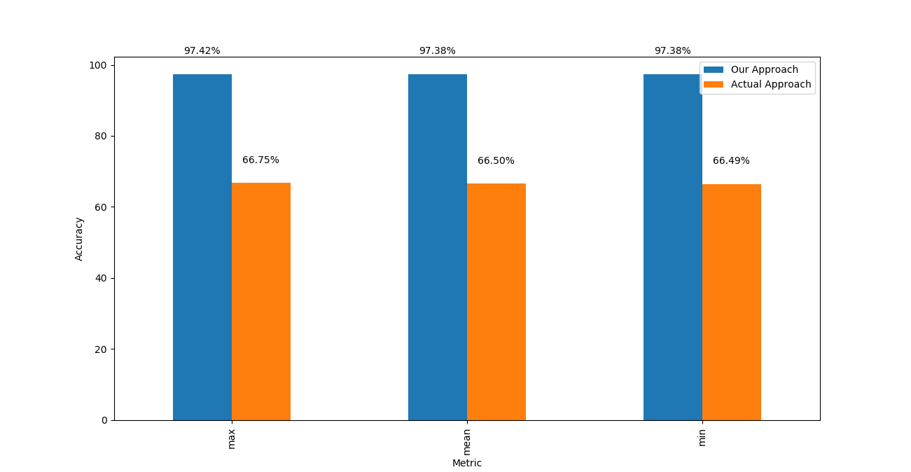
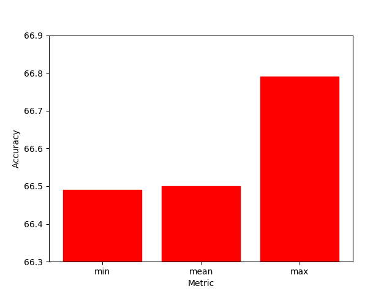
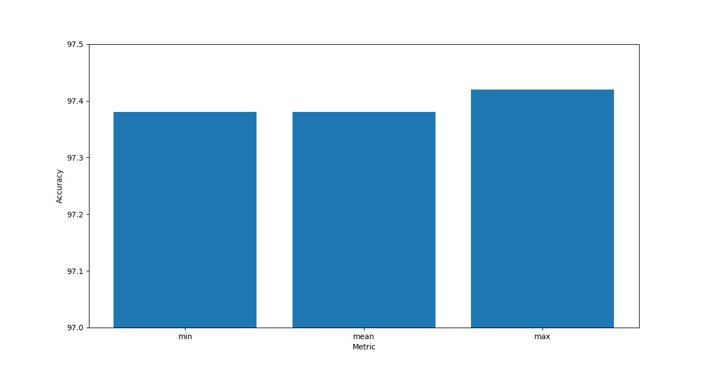

# VQA keras

A Keras implementation of a simple Visual Question Answering (VQA) architecture, using the shape dataset


## Usage

### Setup and Basic Usage

First, clone the repo and install the dependencies:

```shell
git clone https://github.com/Utsavjain4561/Visual-Question-Answering.git
cd VQA
pip install -r requirements.txt
```

To run the model,

```shell
python train.py
```

A typical run with should have results that look like this:
```shell
Epoch 1/8
loss: 0.8887 - accuracy: 0.6480 - val_loss: 0.7504 - val_accuracy: 0.6838
Epoch 2/8
loss: 0.7443 - accuracy: 0.6864 - val_loss: 0.7118 - val_accuracy: 0.7095
Epoch 3/8
loss: 0.6419 - accuracy: 0.7468 - val_loss: 0.5659 - val_accuracy: 0.7780
Epoch 4/8
loss: 0.5140 - accuracy: 0.7981 - val_loss: 0.4720 - val_accuracy: 0.8138
Epoch 5/8
loss: 0.4155 - accuracy: 0.8320 - val_loss: 0.3938 - val_accuracy: 0.8392
Epoch 6/8
loss: 0.3078 - accuracy: 0.8775 - val_loss: 0.3139 - val_accuracy: 0.8762
Epoch 7/8
loss: 0.1982 - accuracy: 0.9286 - val_loss: 0.2202 - val_accuracy: 0.9212
Epoch 8/8
loss: 0.1157 - accuracy: 0.9627 - val_loss: 0.1883 - val_accuracy: 0.9378 
```
Read the "Training" section for how you might improve the accuracy of the model--we were able to get it ot 99.5% validation accuracy!.

### Training

The training script `train.py` has two optional arguments:

```shell
python train.py [--big-model] [--use-data-dir]

Optional arguments:
  --big-model     Use the bigger model with more conv layers
  --use-data-dir  Use custom data directory, at /data
```

The `--big-model` flag trains a slightly larger model, that we
used to train a 97.5% accuracy model used in the following [live demo](http://visualquestionbot.herokuapp.com/).
Generate your own dataset and follow the below procedure
After following the instructions in that repo, just copy the `/data` folder into
the root directory of this repository, so that your files look like this:

```shell
VQA/
├── data/
  ├── answers.txt
  ├── test/
  ├── train/
├── analyze.py
├── model.py
├── prepare_data.py
└── train.py
```

For the 97.5% accuracy model, we used a custom dataset generated with double the images/questions
as the official dataset (set `NUM_TRAIN` and `NUM_TEST` to 8000 and 2000,
respectively, for the `easy-VQA` repo).

### Other Files

In addition to the training script, we have three other files:
- `analyze.py`, a script we used to debug our models. Run using a model weights
  file, and produce statistics about model outputs and confusion matrices to
  analyze model errors.
- `model.py`, where the model architecture is specified
- `prepare_data.py`, which reads and processes the data, either using the
  [easy-vqa package](https://pypi.org/project/easy-vqa/) or a custom data directory

## Result

### Comparing Original Approach  with Approach in VQA

### Original Approach Accuracy vs Number Of Samples

### VQA Approach Accuracy vs Number Of Samples

